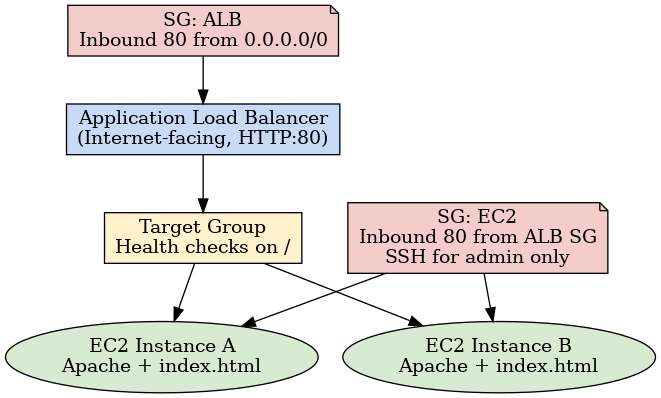

# AWS Broken Web App Challenge

A deliberately misconfigured web application deployed via CloudFormation and fixed through systematic troubleshooting across **Application Load Balancer (ALB)**, **Target Groups**, **EC2**, and **Security Groups**.

## Overview
This project demonstrates troubleshooting a misconfigured web application deployed with an AWS CloudFormation template. The objective was to identify and resolve four issues that prevented the application from being accessed through an Application Load Balancer (ALB).  

Key AWS services involved: **CloudFormation, EC2, Security Groups, Target Groups, Health Checks, and Load Balancers**.

## Architecture


### Components
- **ALB (internet-facing)** with HTTP :80 listener → Target Group
- **Target Group** with health checks on `/`
- **EC2 instances** running Apache web server
- **Security Groups**:
  - ALB SG: inbound HTTP :80 from `0.0.0.0/0`
  - EC2 SG: inbound HTTP :80 from ALB SG only

## Steps Taken
1. **Register Targets** — Target Group initially had no registered instances.  
2. **Health Check Path** — Misconfigured path `/healthcheck.html` corrected to `/`.  
3. **Security Group Rule** — EC2 SG updated to allow HTTP :80 inbound from ALB SG.  
4. **Application Layer** — Apache was not running; installed, started service, added `index.html`.

## Results
- Target Group status: **Healthy (HTTP 200 OK)**  
- ALB DNS endpoint serving application content successfully  

## Quick Start
> Region: **us-east-1**

- CloudFormation Template URL:
- https://cloud-mastery-bootcamp.s3.amazonaws.com/lab-guides/solutions-architecture/broken-web-app-challenge.json

- Deploy stack:
```bash
./infra/deploy-stack.sh <stack-name>
```
- Verify stack health:
```bash
./infra/verify.sh <stack-name>
```
