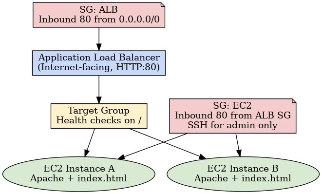

# Architecture

- **ALB (internet-facing)** with HTTP :80 listener
- **Target Group** with health checks on `/`
- **EC2 instances** running Apache on port 80
- **Security Groups** enforce least privilege:
  - ALB SG: HTTP :80 from world
  - EC2 SG: HTTP :80 only from ALB SG

